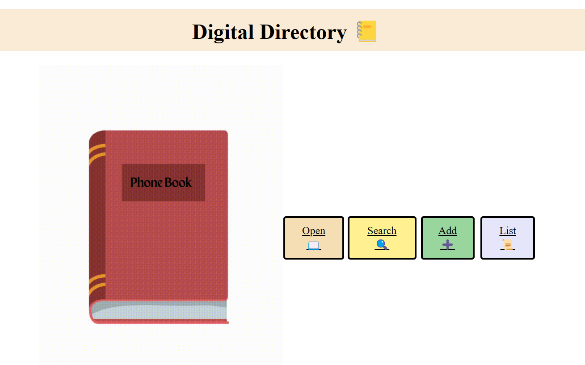

Project Name : Phone Book

Description :  This is a phone book where you can view the contacts, edit the existing contact, delete any contact, add new contact, view the list of contacts.
              Also you can move the pages to back or front and also search for any contact. Contact details of the search will be displayed if its present, 
              else "No result" page will be displayed.

Technologies used : <ol><li>Express(for the backend)</li><li>EJS(for rendering html pages)</li><li>Axios(for handling http requests)</li></ol>

How to run the project : 
<ol>
  <li>Initialise the npm package by using the statement 
    
### `npm init`

</li>
  <li>Install the packages in package.json by using the statement </li>

### `npm i`
  
  <li>Install nodemon if needed to auto restart server as soon as the file is saved </li>

### `npm i nodemon`
  
  <li>To run UI server</li>

### `nodemon client.js`
  
  <li>To run Backend server </li>

### `nodemon server.js`
  
</ol>

Result : You can view the phone book home page in "http://localhost:3000/home"

Improvements needed : 
<ol>
<li>While searching, the result will be displayed only if the search name strictly matches any of the names in the list. Need to improvise this by giving search result 
  that partially matches any of the contact item </li>
</ol>

